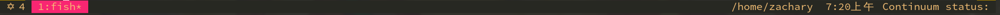

## My tmux config

you should place the file in '~', or `ln -s ~/.config/tmux/.tmux.conf ~/.tmux.conf`

let `prefix` be `c-x`, and resered `c-b`

**session:** 

| bind | function    |
|------|-------------|
| c-c  | new session |

**pane:** 

| bind | function                               |
|------|----------------------------------------|
| =    | split current window horizontally      |
| -    | split current window vertically        |
| h    | move to left pane                      |
| j    | move to down pane                      |
| k    | move to up pane                        |
| l    | move to right pane                     |
| >    | swap current pane with the next one    |
| <    | swap create pane with the previous one |
| HJKL | resize current pane 2 units            |

**window:** 

| bind | function                |
|------|-------------------------|
| c    | new window              |
| 0-9  | select window           |
| w    | show window list        |
| n    | move to next window     |
| p    | move to previous window |
| &    | close current window    |
| ,    | rename current widow    |

**other:** 

| bind | function                  |
|------|---------------------------|
| !    | split widow and open htop |

**change statue bar:**

